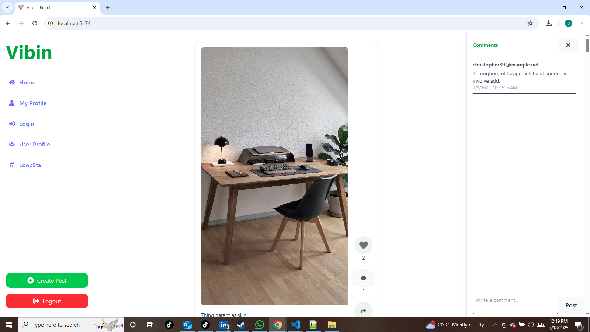
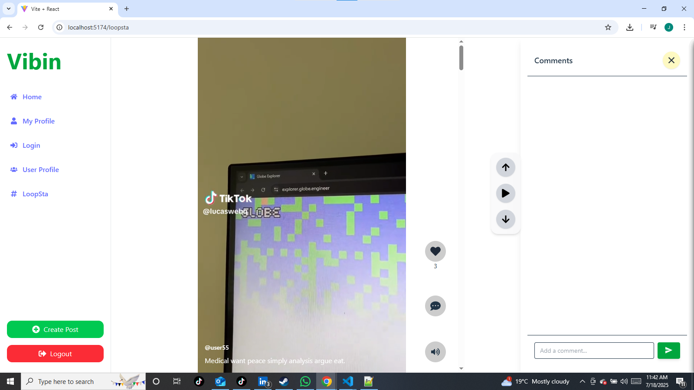

# 📸 Vibin — A Social Media Experience Reimagined

**Vibin** is a fullstack social media web app inspired by Instagram and TikTok. It brings together the classic photo-sharing feed, a TikTok-style video feature ("Loopsta"), user interaction (likes, comments, messaging), and a developer portfolio module — all in one dynamic platform.

Built using **Django (REST)** for the backend and **React (Vite + Tailwind)** for the frontend, Vibin focuses on real-time interactions, smooth UI transitions (Framer Motion), and modern authentication (JWT).

---


## 📸 Screenshots

| Feed Page | Loopsta Video 
|-----------|---------------|
|  |  

---

## 📦 Tech Stack

| Frontend | Backend | Styling | Auth |
|----------|---------|---------|------|
| React (Vite) | Django REST Framework | Tailwind CSS | JWT (SimpleJWT + Axios) |
| Framer Motion | Django ORM | CSS Modules | LocalStorage-based login |
| React Router DOM | PostgreSQL / SQLite | Responsive UI | |

---

## 🎯 Key Features

### 🔗 General
- User Registration / Login (JWT)
- Responsive & mobile-friendly UI
- Beautiful Framer Motion animations

### 📷 Instagram-style Feed
- Upload photos with captions
- Like and comment on posts
- Smooth infinite scrolling
- Toast notifications for interactions

### 📽️ Loopsta (TikTok Clone inside)
- Vertical video playback interface
- Looping autoplay videos
- Like/comment buttons with animation
- Real-time comment modal
- Integrated inside Vibin ecosystem


## 📁 Folder Structure (Frontend)

vibin-frontend/
├── src/
│ ├── components/
│ ├── pages/
│ ├── services/
│ ├── context/ (AuthContext.js)
│ └── App.jsx, main.jsx
└── public/

yaml
Copy
Edit

---

## ⚙️ Getting Started

### 🐍 Backend Setup (Django)

```bash
# Clone the backend
git clone https://github.com/your-username/vibin-backend.git
cd vibin-backend

# Create virtual environment
python -m venv venv
source venv/bin/activate  # or venv\Scripts\activate on Windows

# Install dependencies
pip install -r requirements.txt

# Run migrations & start server
python manage.py migrate
python manage.py runserver
⚛️ Frontend Setup (React + Vite)
bash
Copy
Edit
# Clone the frontend
git clone https://github.com/your-username/vibin-frontend.git
cd vibin-frontend

# Install dependencies
npm install

# Start development server
npm run dev
🔐 Environment Variables
Frontend (.env)
bash
Copy
Edit
VITE_API_URL=http://localhost:8000/api
Backend (.env or settings.py)
ini
Copy
Edit
SECRET_KEY=your-secret
DEBUG=True
ALLOWED_HOSTS=localhost,127.0.0.1
📌 Roadmap
 Instagram-style feed

 Loopsta video player

 Portfolio section

 JWT authentication

 Direct messaging

 User notifications

 Explore page (discovery)

🙌 Acknowledgements
Framer Motion for stunning animations

Django REST Framework for a robust backend

Tailwind CSS for rapid UI development

✍️ Author
Julius Gacheru
Nyeri → Clayworks, Kasarani
🧠 Learning Django, React, and building 🔥 portfolio projects

📫 Contact
GitHub: banju-che

Email: julius.gacheru@example.com (update)

Twitter: @banju_che

🖤 Show Some Love
If you like this project, please give it a ⭐ on GitHub and share it!

yaml
Copy
Edit

---

Would you like this saved into a `.md` file automatically or edited with live data like your actual GitHub links, email, and updated screensho
